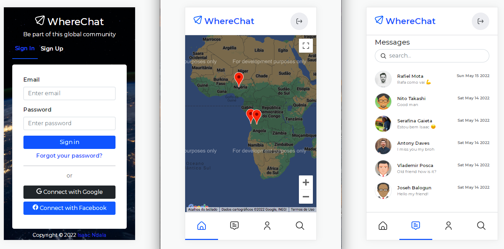

# wherechat-backend


## About the project
This is the backend of Wherechat, which is a chat application that allows users to find and meet each other through their location on the map.


The frontend can found [here](https://github.com/IsaacNdala/wherechat/).

## Built With
* [Node.js](https://nodejs.org/)
* [Express](https://expressjs.com/)
* [Mongoose](https://mongoosejs.com/)
* [Socket.io](https://socket.io/)

## Project Setup

1. Clone the repository
```
git clone git@github.com:IsaacNdala/wherechat-backend.git
```

2. Install NPM packages
```
npm install
```


3. Run the application
```
npm start
```

## Author
👤 <b>Isaac Ndala</b>

GitHub - [@IsaacNdala](https://github.com/IsaacNdala)</br>
Twitter - [@IsaacNdala11](https://twitter.com/IsaacNdala11)</br>
LinkedIn - [Isaac Ndala](https://www.linkedin.com/in/isaac-ndala)

## Contributing
Pull requests are welcome. For major changes, please open an issue first to discuss what you would like to change.

## License
This project is licensed under the [MIT](https://choosealicense.com/licenses/mit/) License

## Show Support
⭐️  ⭐️  ⭐️
